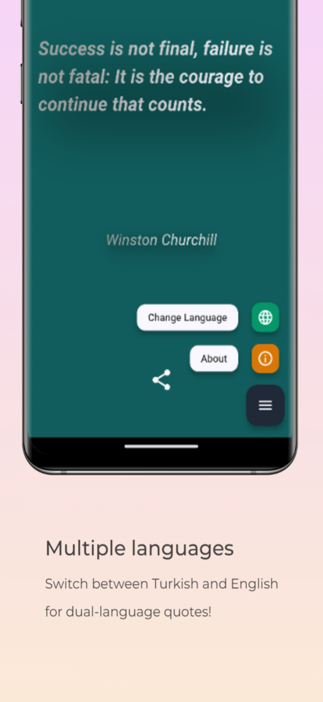

# Random Quotes App

Flutter app that allows users to explore and discover random quotes in Turkish and English.

## Features

- View random quotes in Turkish and English.
- Switch between languages seamlessly.
- Share your favorite quotes with friends.

## Screenshots

  

### Video


## Getting Started

1. Clone the repository:
   ```bash
   git clone https://github.com/your-username/random-quotes-app.git
   ```
2. Navigate to the project directory:
   ```bash
   cd random-quotes-app
   ```
3. Install dependencies:
   ```bash
   flutter pub get
   ```
4. Run the app:
   ```bash
   flutter run
   ```

## Contributing

If you'd like to contribute, please fork the repository and create a pull request. Issues and feature requests are welcome!
